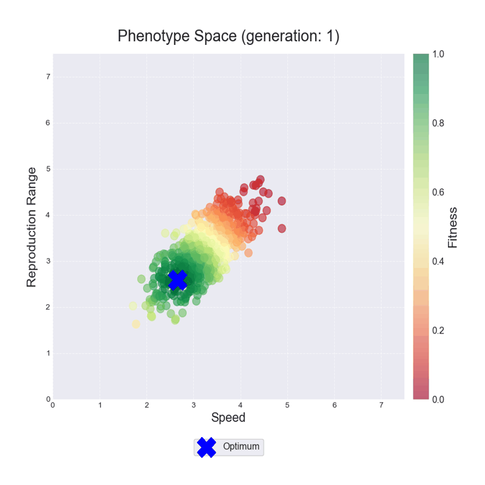

# Fisher-Geometric-Model
Geometric Fisher Model simulation to observe successive adaptation.

## Applicaton Description
This project is a streamlit application to simulate the evolution of a population with a genotype determining phenotype. A detailed description can be found [here](https://github.com/kugi8412/Fisher-Geometric-Model/blob/main/Geometryczny_Model_Fishera.pdf).

## Running the Program
The required libraries can be installed them using `pip install -r requirements.txt`.

To launch the program, go to the source directory and `streamlit run main.py`.

### Example analysis
The application allows you to see how the position of individuals changes over successive generations as their phenotype attempts to match the existing optimum in the environment.

<table>
  <tr>
    <td></td>
    <td></td>
  </tr>
</table>

The application allows you to see how the average allele value of each gene changes over time and the change in frequency in the population. For example, below, for random selection with capacity, without taking into account the adaptation of individuals, there is a bottleneck around the 40th generation. As the abundance of the population increases, the allele value tends towards equilibrium. Population numbers, however, are stabilising at a certain level, which shows the effect of habitat capacity on reproduction.

The application also allows quantitative analysis: you can select two parameters, divide their ranges into equal intervals and then perform a grid search. The result is the average number of individuals that survived the entire simulation. In this way it is possible to assess how changes in the selected parameters affect the survival of the population.

The relationship between the mutation rate and the level of noise with which the optimal genotype changes is shown below. It can be seen that even a small chance of mutation allows a population to survive - which mechanism explains this phenomenon? On the other hand, too much change in genotype can be lethal for a population. Interestingly, for a rapidly changing genotype, a higher mutation rate - up to a point - can help a population survive. 

Check yourself out ❓

Genetic recombination, Crossing-over

#### GOOD LUCK AND HAVE FUN 😺
